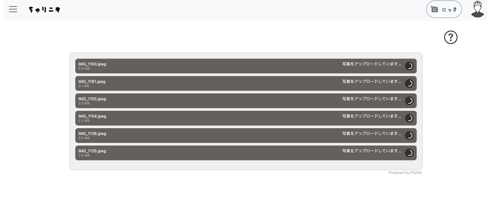
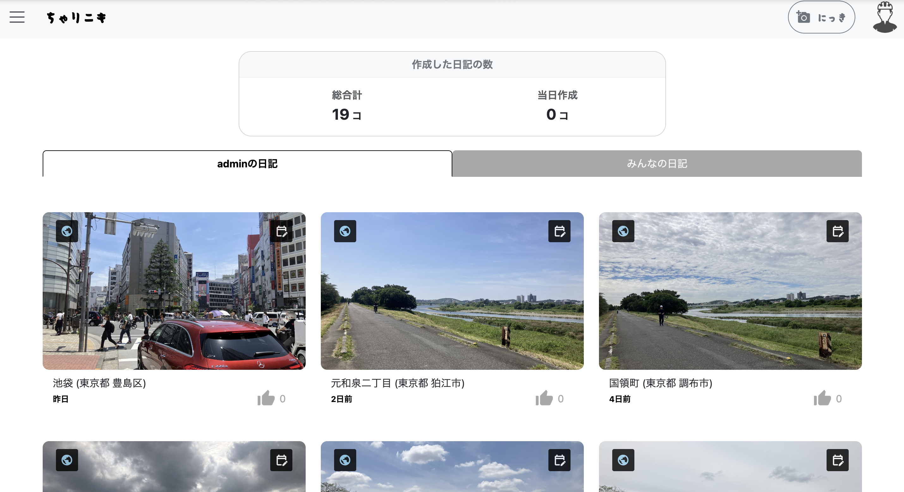

# ちゃりニキ（英語名：CycleDiary） - サイクリング日記アプリ

## 概要

**CycleDiary** は、サイクリングの記録・位置・写真・感想を簡単に管理できる Web アプリケーションです。日々のライドを位置情報と共に記録し、後から振り返ることができます。

## 主な機能

### 1. 日記作成機能
- 写真をアップロードすることで、**位置情報と連動**したライド記録を自動取得  
- 写真に位置情報がない場合は、任意の地域を文字検索により自由に指定可能  
- 日記形式でのコメント記録  
- 投稿の**編集・削除・公開設定**が可能  

<h3>日記作成画面の流れ</h3>

<strong>アップロード前画面</strong>

<strong>アップロード中画面</strong>

<strong>アップロード後画面（コメント入力・投稿設定画面）</strong>

<strong>位置情報がない、編集したい場合の地域検索入力</strong>

### 2. 振り返り機能
- **マップ**上で過去に行った場所とその写真を表示  
- **カレンダー**で日付ごとの投稿を確認  
- **ホーム画面**では、自分の記録（サムネ付き）と他ユーザーの公開投稿を一覧表示  

<strong>振り返り機能（マップ）</strong>

<strong>振り返り機能（カレンダー）</strong>

<strong>ホーム画面1</strong>

<strong>ホーム画面2</strong>

### 3. 天気予報
- 任意の地域を選択し、**天気予報を表示**  
- 地域は文字検索により自由に指定可能  

<strong>天気予報機能</strong>

### 4. ゲーム機能（Phaser.js）
- Phaser.js を用いたエンドレスラン形式のミニゲーム  
- ユーザーは日記投稿によって得た **コイン** を使って、ゲーム内キャラクターをアンロック可能  

<a href="./GAME.md">ゲームの詳細はこちら（GAME.md）</a>

## 使用技術

| カテゴリ       | 技術スタック               |
|----------------|----------------------------|
| フロントエンド | HTML / CSS / JavaScript   |
| バックエンド   | Django (Python)            |
| データベース   | SQLite（開発環境）        |
| その他         | Git / GitHub / Bootstrap  |

##  工夫した点
### 1. モジュール設計と依存性の排除
- フロントエンド・バックエンドの両方でモジュール化を意識しました。
- 各機能が過度に依存しない構成とすることで、保守性と拡張性を高めました。

### 2. UI/UX の設計
- Bootstrap や SweetAlert を活用し、直感的で違和感のないデザインにしました。
- 視認性と操作性に配慮し、快適に操作できる画面を目指しました。

### 3. API設計と非同期通信
- 投稿・認証以外の処理をすべて API 化しました。
- Ajax や Django の async ビューを用い、非同期通信で快適なレスポンスを実現しました。

### 4. 認証機能
- 任意のユーザー名とメールアドレスだけでアカウントを作成できるようにしました。
- Google アカウントによる OAuth 認証にも対応しました。

### 5. 日記投稿機能
- 写真の Exif 情報から位置と日時を取得し、逆ジオコーディング API で住所を自動補完しました。
- 投稿の手間を減らし、継続しやすい設計にしました。
- 複数写真の非同期アップロードで投稿処理を高速化しました。

### 6. 日記閲覧・編集・絞り込み機能
- カレンダーや地図で「いつ」「どこへ」行ったかを視覚的に確認できるようにしました。
- 地図には、投稿の絞り込み機能（例：直近1ヶ月）を実装しました。
- 投稿の編集は、カレンダー画面から直接かつ非同期で行えるようにしました。

### 7. 住所指定・現在地取得機能
- ジオコーディング API を使って、入力された地名から住所を検索できるようにしました。
- JavaScript の `navigator.geolocation` API を用いて、現在地の自動取得にも対応しました。

### 8. 天気予報機能
- 地名を指定することで、その地点の天気予報を表示できるようにしました。
- 天気情報は天気予報 API を使って取得・加工・出力しています。

### 9. ゲーム機能との連携（Games）
- Phaser.js により、エンドレスラン形式のゲームを実装しました。
- 日記投稿に応じて使用可能なキャラクターが増える仕組みにしました。
- Diary 側のアカウント情報と連携することで、アカウント作成の手間を省きました。

##  学んだこと

- **Djangoモデルを活用したユーザーや投稿データの管理方法**  
- **フロントエンドとバックエンドの連携構築の実践経験**  
- **基本的な HTML / JavaScript の記述と、UI 表現（ポップアップ・アニメーション等）の実装**  
- **Ajax や Django の async 機能による非同期処理とパフォーマンス最適化方法**  
- **`.env` を用いた開発環境とセキュリティの管理方法の理解**  
- **理想の機能を実現するために、試行錯誤を繰り返し粘り強く取り組むことの重要性**

##  注意：このリポジトリは開発環境用です

このプロジェクトは **開発環境用の構成** になっており、`.env` ファイル（環境変数を定義するファイル）がリポジトリには含まれていません。

そのため、**この状態ではアプリケーションを起動することはできません**。

各ライセンスに関しては[こちら](./THIRD_PARTY_LICENSES.md)
